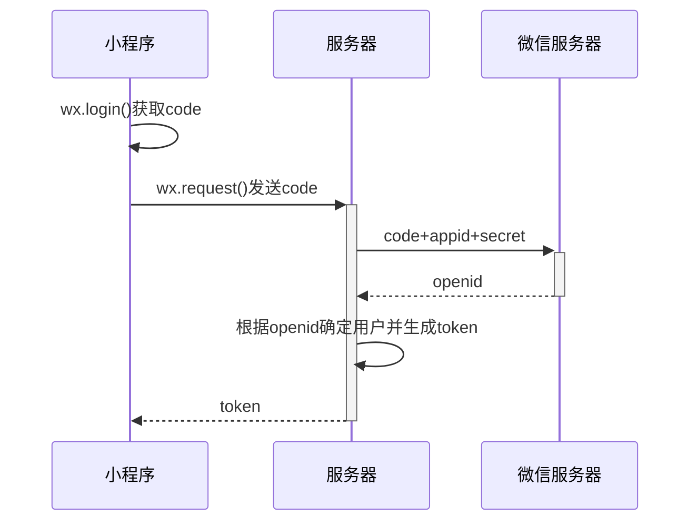

# 我的学习笔记

## C++

空的

## pytorch

也是空的

## Linux

还是空的

> 啥也没写，以后都会写的


```c
void SplitString(const std::string &s, std::vector<std::string> &v, const std::string &c)
{
    std::string::size_type pos1, pos2;
    pos2 = s.find(c);
    pos1 = 0;
    while (std::string::npos != pos2)
    {
        v.push_back(s.substr(pos1, pos2 - pos1));

        pos1 = pos2 + c.size();
        pos2 = s.find(c, pos1);
    }
    if (pos1 != s.length())
        v.push_back(s.substr(pos1));
}
```




